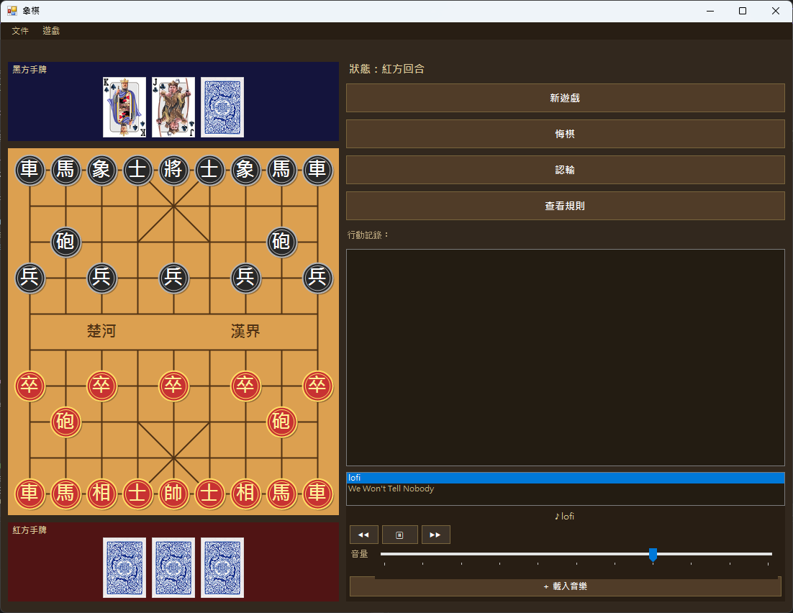
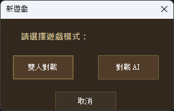
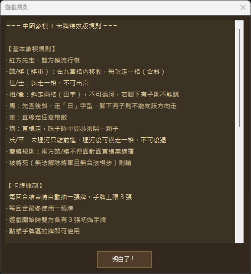
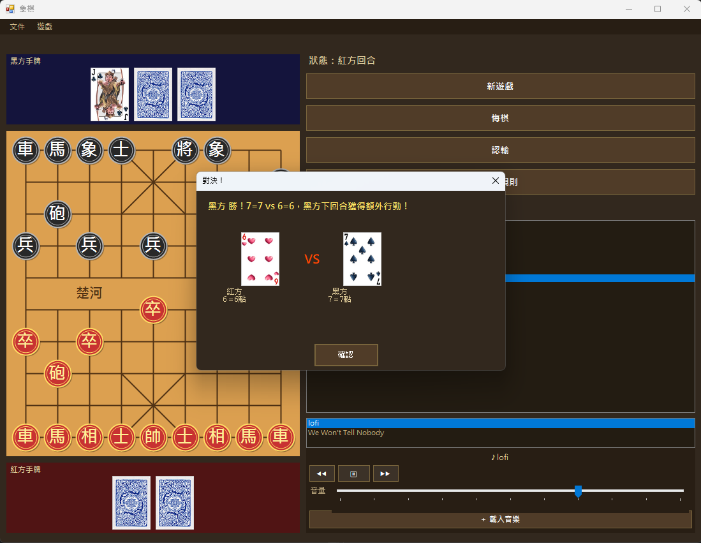
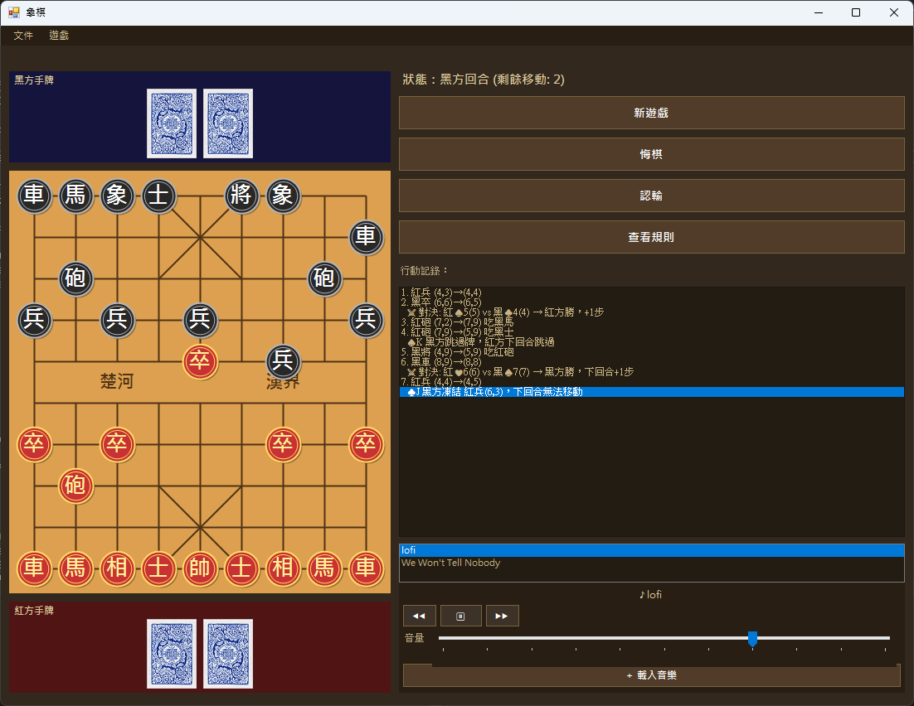

# ♟️ 象棋遊戲 — 卡牌特效版 (Chinese Chess + Cards)

一個以 C# Windows Forms 製作的中國象棋遊戲，在傳統象棋規則之上加入**撲克牌特效系統**與**背景音樂播放器**。支援雙人對戰與 AI 對戰，並具備存讀檔、悔棋、行動記錄等完整功能。

## 📸 截圖

**主畫面**


**選擇遊戲模式**


**遊戲規則**


**對決翻牌**


**行動記錄**


## ✨ 功能

### 基本象棋
- **♟️ 完整象棋規則**：7 種棋子各自的移動規則、將軍 / 將死判定、雙將（飛將）限制
- **🔄 棋盤翻轉**：依象棋慣例紅方在下、黑方在上
- **🎯 走子提示**：選取棋子後標示所有合法落點
- **↩️ 悔棋**：可撤回上一步走棋（含 Q 牌復活的還原）
- **🏳️ 認輸**：直接結束本局，對方獲勝

### 卡牌特效系統
- **🎴 抽卡機制**：每回合結束自動抽 1 張牌，手牌上限 3 張；開局雙方各 3 張
- **🂠 牌面隱藏**：功能牌（J/Q/K）正面顯示，對決牌（A、2–10）以牌背顯示，對決時才翻開
- **❄️ J 牌（凍結）**：點選對方一顆棋子，使其下回合無法移動
- **💟 Q 牌（復活）**：從己方陣亡棋子中選一顆放回棋盤
- **⏭️ K 牌（跳過）**：使對方下一回合直接跳過
- **⚔️ A / 2–10（對決）**：與對方比牌大小（A = 14），勝方多走一步，平手則各補一張牌

### 遊戲模式
- **👥 雙人對戰**：兩位玩家在同一台電腦上輪流操作
- **🤖 對戰 AI**：AI 會走棋並自動使用卡牌（優先 K / J，再考慮對決）

### 系統功能
- **💾 存檔 / 讀檔**：完整保存棋盤、雙方手牌、陣亡棋子、回合狀態與行動記錄
- **📜 行動記錄**：依時間順序記錄走棋與卡牌事件（凍結、復活、跳過、對決結果）
- **🎵 背景音樂播放器**：內建播放 / 暫停、上下首、音量調整、曲目清單選曲
- **➕ 載入音樂**：遊戲中可隨時讀取任意 `.mp3` 檔加入播放清單
- **📖 規則說明**：開局自動顯示，遊戲中可隨時點「查看規則」開啟
- **🎨 深色主題**：整體採用棕金配色的統一視覺風格

## 🛠️ 開發環境

| 項目 | 版本 |
|------|------|
| 語言 | C# |
| 框架 | .NET Framework 4.7.2 |
| UI | Windows Forms |
| IDE | Visual Studio 2022 |
| 音訊 | Windows MCI (`winmm.dll`) |

## 🚀 執行方式

1. 以 Visual Studio 2022 開啟 `ChineseChess.sln`
2. 建置專案（Build → Build Solution，或 `Ctrl+Shift+B`）
3. 執行（`F5` 或 `Ctrl+F5`）
4. 啟動後先閱讀規則，再選擇「雙人對戰」或「對戰 AI」開始遊戲

## 📁 專案結構

```
ChineseChess/
├── Images/                       # README 截圖
│   ├── sample.png                # 主畫面
│   ├── mode.png                  # 模式選擇
│   ├── rule.png                  # 規則說明
│   ├── skill.png                 # 對決翻牌
│   └── record.png                # 行動記錄
├── ChineseChess/
│   ├── Models/                   # 資料模型
│   │   ├── Piece.cs / PieceType.cs / PlayerColor.cs / Position.cs / Move.cs
│   │   └── Card.cs / CardSuit.cs / CardEffect.cs / Hand.cs
│   ├── Game/                     # 遊戲邏輯
│   │   ├── Board.cs              # 棋盤狀態
│   │   ├── GameLogic.cs          # 核心流程、行動記錄
│   │   ├── GameState.cs          # 回合 / 卡牌狀態
│   │   ├── MoveValidator.cs      # 走子規則驗證
│   │   ├── GameSerializer.cs     # 存讀檔 (自製 JSON)
│   │   ├── AIPlayer.cs           # AI 決策
│   │   ├── CardDeck.cs / CardManager.cs / CardEffectProcessor.cs
│   │   └── GameMode.cs
│   ├── UI/                       # 使用者介面
│   │   ├── BoardPanel.cs         # 棋盤繪製與互動
│   │   ├── CardPanel.cs          # 手牌顯示
│   │   ├── DuelDialog.cs         # 對決視窗（兩階段翻牌）
│   │   ├── ReviveDialog.cs       # 復活選擇視窗
│   │   ├── GameModeDialog.cs     # 模式選擇視窗
│   │   ├── RulesDialog.cs        # 規則說明視窗
│   │   ├── AudioManager.cs       # MP3 播放控制 (MCI)
│   │   ├── AudioPanel.cs         # 音樂播放面板
│   │   └── SoundManager.cs       # 音效
│   ├── Resources/Music/          # 內建背景音樂
│   ├── poker/                    # 撲克牌圖片 (pic1~pic52, back)
│   ├── frmChineseChess.cs        # 主表單
│   └── Program.cs                # 程式進入點
└── ChineseChess.sln
```

## ♟️ 象棋規則簡介

- 棋盤：9 列 × 10 行，中間以「楚河漢界」分隔紅黑兩方
- 各方 16 子：1 將 / 帥、2 士 / 仕、2 象 / 相、2 馬、2 車、2 砲、5 兵 / 卒

| 棋子 | 移動規則 |
|------|----------|
| 將 / 帥 | 九宮內前後左右走 1 格，雙將不得直線照面 |
| 士 / 仕 | 九宮內斜走 1 格 |
| 象 / 相 | 斜走 2 格（田字），不過河，象眼被卡不能走 |
| 馬 | 走「日」字，馬腳被卡不能走 |
| 車 | 直線走任意格數 |
| 砲 | 直線移動，吃子時中間須隔 1 子 |
| 兵 / 卒 | 未過河只能前進，過河後可橫走，不可後退 |

> 被將軍且無法解除（無合法棋步）即為將死，該方落敗。

## 🎴 卡牌規則簡介

- 每回合**結束時**自動抽 1 張牌，手牌上限 3 張，每回合最多使用 1 張
- 點擊手牌區的牌即可使用
- 對決牌以**牌背**顯示，避免提前看到點數；對決時雙方同時翻開揭曉

| 牌 | 效果 |
|----|------|
| J | 凍結對方一顆棋子，下回合無法移動 |
| Q | 復活己方一顆陣亡棋子放回棋盤 |
| K | 對方下一回合直接跳過 |
| A / 2–10 | 發起對決比大小（A = 14），勝方多走一步；平手雙方各補一張牌；對方無對決牌則自動判負 |

## 📖 使用說明

1. 啟動後閱讀規則，於模式視窗選擇「雙人對戰」或「對戰 AI」
2. 點擊棋子查看合法落點，再點目標位置移動
3. 點擊手牌使用卡牌效果；對決時於彈窗選牌應戰
4. 右側「行動記錄」即時顯示走棋與卡牌事件
5. 透過「文件」選單存檔 / 讀檔，可保留完整對局狀態
6. 音樂面板可播放 / 切換曲目、調整音量，並以「＋ 載入音樂」加入自己的 MP3

## 📄 授權

本專案採用 [MIT License](LICENSE.txt) 授權。

---

**開發者**：Austin Yin
